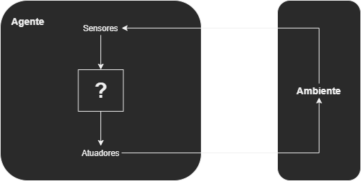

### Agentes e Ambientes

Um **agente** é qualquer entidade capaz de observar o **ambiente** através de **sensores** e agir sobre esse ambiente utilizando **atuadores**.

A interação de um agente com seu ambiente pode ser descrita pelo **ciclo de percepção-ação**: em cada etapa do tempo, o agente recebe uma **percepção** (input) do ambiente através de seus sensores, processa essa informação e realiza uma **ação** (output) no ambiente através de seus atuadores.

A **função do agente** mapeia uma sequência de percepções para uma ação a ser tomada. Idealmente, essa função permite ao agente agir de forma a alcançar seus objetivos ou cumprir sua tarefa da maneira mais eficaz possível.

Os ambientes em que os agentes operam podem variar amplamente em complexidade e características. Eles podem ser:

- **Totalmente observáveis** vs. **Parcialmente observáveis**: Em um ambiente totalmente observável, a percepção atual oferece toda a informação relevante sobre o estado do ambiente. Por outro lado, em ambientes parcialmente observáveis, a percepção pode não fornecer informações completas.

- **Determinísticos** vs. **Estocásticos**: Se o estado futuro do ambiente é completamente determinado pelo estado atual e pela ação do agente, o ambiente é determinístico. Caso contrário, é estocástico.

- **Estáticos** vs. **Dinâmicos**: Em ambientes estáticos, o ambiente não muda enquanto o agente está deliberando. Ambientes dinâmicos mudam ao longo do tempo, independentemente das ações do agente.

- **Discretos** vs. **Contínuos**: Em ambientes discretos, há um número finito ou contável de estados e ações. Em ambientes contínuos, há um número infinito de possíveis estados ou ações.

A compreensão e modelagem adequadas do ambiente são cruciais para o design de um agente eficaz. A estratégia do agente para alcançar seus objetivos depende não apenas de suas capacidades e tarefas, mas também das propriedades do ambiente em que opera.

---

[Voltar ao README principal](../../README.md)
